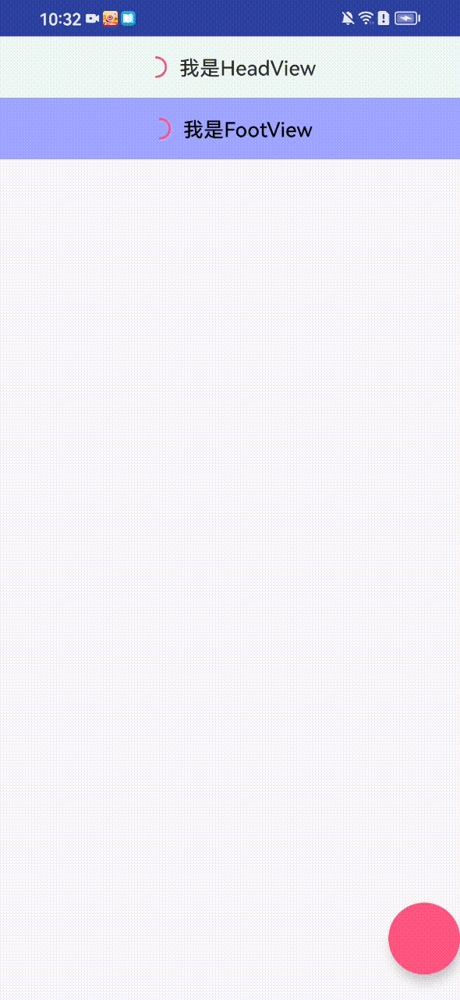

**项目中发现一个奇怪的现象**：

RecyclerView 加载完数据以后，调用 notifyItemInserted 方法，RecyclerView 会滑动到底部。因为这个 RecyclerView 的适配器有一个 FootViewHolder，所以怀疑是 FootViewHolder 的问题。通过源码分析，果然是FootViewHolder的问题。


先说下结论：

* 调用 notifyItemInserted 方法的时候，会把 FootViewHolder 的 position 向下偏移。在预布局dispatchLayoutStep1 结束的时候， FootViewHolder 的 position = 4。
* 在 dispatchLayoutStep2 阶段，会以 FootViewHolder 为锚点 position = 4 进行填充。先填充 FootViewHolder。此时FootViewHolder 布局在屏幕中的坐标是  top = 0，bottom = 144。(FootView 的高度就是144)
* 从 position =5 向锚点下方填充，此时没有更多的数据。
* position = 3 向锚点上方填充，直到没有更多空间。
* 此时 FootViewHolder 距离 RecyclerView底部还有很大一段距离。RecyclerView 会向下偏移所有的子View，结束后，FootViewHolder的bottom 就是 RecyclerView的 最底部的坐标。
* dispatchLayoutStep3 阶段，FootViewHolder 执行一个 move 动画，从上向下移动一段距离。
* 新创建的 ViewHolder 执行 alpha 动画，从透明到不透明。


**适配器代码**

```kotlin
class TestAnimatorAdapter(
    private val context: Context
) : RecyclerView.Adapter<TestAnimatorAdapter.ViewHolder>() {

    companion object {
        val TYPE_FOOT = 1
        val FOOT_COUNT = 1
    }

    val dataList = mutableListOf<CheckBoxModel>()

    fun onDataSourceChanged(dataList: MutableList<CheckBoxModel>) {
        this.dataList.clear()
        this.dataList.addAll(dataList)
    }

    override fun onCreateViewHolder(parent: ViewGroup, viewType: Int): ViewHolder {
        if (viewType == TYPE_FOOT) {
            val view =
                LayoutInflater.from(context).inflate(R.layout.foot_view_load_more, parent, false)
            return FootViewHolder(view)
        }
        val view =
            LayoutInflater.from(context).inflate(R.layout.item_test_animation, parent, false)
        return ViewHolder(view)
    }

    override fun onBindViewHolder(holder: ViewHolder, position: Int) {
        if (position == itemCount - 1) {
            return
        }
        val model = dataList[position]
        holder.checkBox?.isSelected = model.isChecked
        holder.textDescription?.text = model.description
    }

    override fun getItemCount(): Int {
        return dataList.size + FOOT_COUNT
    }

    override fun getItemViewType(position: Int): Int {
        if (position == itemCount - 1) {
            return TYPE_FOOT
        }
        return super.getItemViewType(position)
    }

    open class ViewHolder(itemView: View) : RecyclerView.ViewHolder(itemView) {
        var checkBox: CheckBox? = null
        var textDescription: TextView? = null

        init {
            checkBox = itemView.findViewById(R.id.check_box)
            textDescription = itemView.findViewById(R.id.text_description)
        }
    }

    class FootViewHolder(itemView: View) : ViewHolder(itemView)

}

```

适配器有一个 FooterViewHolder。


**测试代码**：添加4个数据，然后调用 notifyItemInserted 方法。

```kotlin
binding.btnNotifyItemChanged.setOnClickListener {

    val newArrayList = arrayListOf<CheckBoxModel>()
    for (i in 0 until 4) {
        newArrayList.add(CheckBoxModel("hi Hello$i", false))
    }
    testAnimatorAdapterAdapter.onDataSourceChanged(newArrayList)
    for (index in 0 until 4) {
        //总共添加了4条数据，调用4次 notifyItemInserted 
        testAnimatorAdapterAdapter.notifyItemInserted(index)
    }
}
```


调用 Adapter#notifyItemInserted 方法以后，会调用 RecyclerView 的 dispatchLayout 方法。


```java
void dispatchLayout() {
    //...
    mState.mIsMeasuring = false;
    if (mState.mLayoutStep == State.STEP_START) {
        //注释1处，调用dispatchLayoutStep1方法。
        dispatchLayoutStep1();
        mLayout.setExactMeasureSpecsFrom(this);
        //注释2处，调用dispatchLayoutStep2方法。
        dispatchLayoutStep2();
    } else if (mAdapterHelper.hasUpdates() || mLayout.getWidth() != getWidth()
            || mLayout.getHeight() != getHeight()) {
        // First 2 steps are done in onMeasure but looks like we have to run again due to
        // changed size.
        mLayout.setExactMeasureSpecsFrom(this);
        dispatchLayoutStep2();
    } else {
        mLayout.setExactMeasureSpecsFrom(this);
    }
    //注释3处，调用dispatchLayoutStep3方法。
    dispatchLayoutStep3();
}

```


## dispatchLayoutStep1 预布局阶段


在预布局阶段，首先会调用 RecyclerView 的 offsetPositionRecordsForInsert 方法，将已有的 FootViewHolder 向后移动，为插入的ViewHolder 留出位置。在我们的例子中，添加了4条数据，调用4次 notifyItemInserted 。最后 FootViewHolder 的 position 从 0 变化到 4 。

```java
void offsetPositionRecordsForInsert(int positionStart, int itemCount) {
    final int childCount = mChildHelper.getUnfilteredChildCount();
    for(int i = 0; i < childCount; i++) {
        final ViewHolder holder = getChildViewHolderInt(mChildHelper.getUnfilteredChildAt(i));
        if(holder != null && !holder.shouldIgnore() && holder.mPosition >= positionStart) {
            if(sVerboseLoggingEnabled) {
                Log.d(TAG, "offsetPositionRecordsForInsert attached child " + i + " holder " + holder + " now at position " + (holder.mPosition + itemCount));
            }
            holder.offsetPosition(itemCount, false);
            mState.mStructureChanged = true;
        }
    }
    mRecycler.offsetPositionRecordsForInsert(positionStart, itemCount);
    requestLayout();
}
```

**Evaluate FootViewHolder**

```java
 FootViewHolder{bd564b0 position=4 id=-1, oldPos=0, pLpos:0}
 ```

然后就没什么特殊的，内部会调用一次 `mLayout.onLayoutChildren(mRecycler, mState);`，进行预布局。**预布局结束的时候，只有一个FootViewHolder**。 **FootViewHolder还是被布局在了 position = 0 的位置。 预布局的时候，使用的是 pLpos = 0** 。

**这里要注意一下**：预布局结束的时候，FootViewHolder 的 position=4 。在 dispatchLayoutStep2 阶段布局的时候，使用的是  position。也就是说会把 FootViewHolder 布局在 position=4 的位置。


## dispatchLayoutStep2


内部会调用一次 `mLayout.onLayoutChildren(mRecycler, mState);`，进行布局。

这个时候先评估一下  LinearLayoutManager.mAnchorInfo 的值

```java
AnchorInfo{mPosition=4, mCoordinate=0, mLayoutFromEnd=false, mValid=true}
```

注意：**此时锚点位置 mAnchorInfo.mPosition =  4** 。

onLayoutChildren 方法内部，

1. 先 **detachAndScrapAttachedViews** 回收 FootViewHolder。没啥可说的。

2. 然后调用 **updateLayoutStateToFillEnd(AnchorInfo anchorInfo)** 方法。**将 mLayoutState.mCurrentPosition** 设置为 4。
3. 然后调用 fill 方法进行填充。这时候，锚点位置是 4，对应的 ViewHolder是 FootViewHolder ，所以会先布局 FootViewHolder。FootViewHolder ，布局位置是  top = 0，bottom = 144。(FootView 的高度就是144)
4. 然后 FootViewHolder 后面没有数据了。此时 mLayoutState.mCurrentPosition = 5。(Adapter 只有 4条数据加一个Foot，position最大是4)。从锚点开始向下填充结束。

### 接下来要从锚点开始向上填充

LinearLayoutManager 的 onLayoutChildren 方法中部分代码

```java
 // fill towards start
updateLayoutStateToFillStart(mAnchorInfo);
mLayoutState.mExtraFillSpace = extraForStart;
//注释1处，这里会将 mLayoutState.mCurrentPosition 改为3
mLayoutState.mCurrentPosition += mLayoutState.mItemDirection;
fill(recycler, mLayoutState, state, false);
```


先调用 updateLayoutStateToFillStart(AnchorInfo anchorInfo) 方法。更新一些信息。将mLayoutState.mLayoutDirection 赋值为 LayoutState.LAYOUT_START(值是-1);

紧接着调用了一行代码 ` mLayoutState.mCurrentPosition += mLayoutState.mItemDirection;`。向上填充的时候，mLayoutState.mItemDirection = -1。计算出来，**mLayoutState.mCurrentPosition = 4 - 1 = 3**。

**然后调用 fill 方法向上填充：**

layoutChunk 方法中 ViewHolder3 的 布局 `layoutDecoratedWithMargins(view, left, top, right, bottom);` 位置是在 FootViewHolder 上面 top = -900，bottom = 0。

ViewHolder2 的 布局位置是 top = -1800，bottom = -900。

ViewHolder1 的 布局位置是 top = -2700，bottom = -1800。

布局完 ViewHolder1，以后，`remainingSpace < 0` ，结束向上填充。

这个时候，FootViewHolder 的位置是 top = 0，bottom = 144。距离 RecyclerView 的底部还有很大的一段距离(在我们的例子中是 2111像素)。然后会走到 fixLayoutEndGap 方法。


```java
private int fixLayoutEndGap(int endOffset, RecyclerView.Recycler recycler,
    RecyclerView.State state, boolean canOffsetChildren) {
    //注释1处，这里大于0，2111px，表示end方向有空隙
    int gap = mOrientationHelper.getEndAfterPadding() - endOffset;
    int fixOffset = 0;
    if(gap > 0) {
        //注释2处，向下滚动
        fixOffset = -scrollBy(-gap, recycler, state);
    } else {
        return 0; // nothing to fix
    }
    // move offset according to scroll amount
    endOffset += fixOffset;
    if(canOffsetChildren) {
        // re-calculate gap, see if we could fix it
        gap = mOrientationHelper.getEndAfterPadding() - endOffset;
        if(gap > 0) {
            mOrientationHelper.offsetChildren(gap);
            return gap + fixOffset;
        }
    }
    return fixOffset;
}
```

注释1处，这里大于0，表示end方向有空隙。

注释2处，向下滚动。这个时候，最大滚动距离是 2111 像素。


```java
int scrollBy(int delta, RecyclerView.Recycler recycler, RecyclerView.State state) {
    if(getChildCount() == 0 || delta == 0) {
        return 0;
    }
    ensureLayoutState();
    mLayoutState.mRecycle = true;
    final int layoutDirection = delta > 0 ? LayoutState.LAYOUT_END : LayoutState.LAYOUT_START;
    final int absDelta = Math.abs(delta);
    updateLayoutState(layoutDirection, absDelta, true, state);
    final int consumed = mLayoutState.mScrollingOffset + fill(recycler, mLayoutState, state, false);
    if(consumed < 0) {
        if(DEBUG) {
            Log.d(TAG, "Don't have any more elements to scroll");
        }
        return 0;
    }
    final int scrolled = absDelta > consumed ? layoutDirection * consumed : delta;
    //注释1处，偏移子View
    mOrientationHelper.offsetChildren(-scrolled);
    if(DEBUG) {
        Log.d(TAG, "scroll req: " + delta + " scrolled: " + scrolled);
    }
    mLayoutState.mLastScrollDelta = scrolled;
    return scrolled;
}
```

注释1处，偏移所有的子View。也就是说所有的子View向下滚动了2111像素。

FootViewHolder会偏移到 RecyclerView 的底部。 FootViewHolder 的 top = 2111，bottom = 2255。


滚动了这么多的距离，需要填充新的ViewHolder吗？不需要，我们在上面分析中，ViewHolder1 的 top 是 -2700足够滚动到屏幕中，还有剩余589px。

ViewHolder3 的 top 是 1211 ，bottom 是 2111。

ViewHolder2 的 top 是 311，bottom 是 1211。

ViewHolder1 的 top 是 -589，bottom 是 311。


**dispatchLayoutStep2 结束**

## dispatchLayoutStep3 阶段，执行动画

记录当前阶段的动画信息，对比 dispatchLayoutStep1 阶段记录的动画信息，执行合适的动画。


FootViewHolder 会执行 move 动画。此时 FootViewHolder 的 top 是 2111。

动画开始前，把 FootViewHolder 的 translationY 设置为 -2111。在动画过程中，变化到 translationY = 0 。 实现了从上滑动到底部的效果。

新增的 ViewHolder 会执行 alpha 透明度动画。动画开始前 alpha = 0，动画结束后 alpha = 1。

**dispatchLayoutStep3 结束**


在搞明白了这个问题以后，有想到另一个问题。如果给适配器加一个HeadViewHolder，那么 notifyItemInserted 以后，RecyclerView 就会以会以 HeadViewHolder 为锚点，从上到下进行布局，是不是就可以解决 **因为 有FootViewHolder 而导致 RecyclerView
自动滚动到底部的问题呢？**，我们来验证一下。

改造过后的适配器代码 有一个 HeadViewHolder，并且新增了一个 myNotifyItemInserted 方法。。

```kotlin
class TestAnimatorAdapter(
    private val context: Context
) : RecyclerView.Adapter<TestAnimatorAdapter.ViewHolder>() {

    companion object {
        val TYPE_HEADER = -1
        val TYPE_FOOTER = 1

        val HEAD_COUNT = 1
        val FOOT_COUNT = 1

        private const val TAG = "TestAnimatorAdapterAdap"
    }

    val dataList = mutableListOf<CheckBoxModel>()

    fun onDataSourceChanged(dataList: MutableList<CheckBoxModel>) {
        this.dataList.clear()
        this.dataList.addAll(dataList)
    }


    /**
     * 这里一定要注意了，因为有head，所以要加上head的数量
     */
    fun myNotifyItemInserted(position: Int) {
        notifyItemInserted(position + HEAD_COUNT)
    }

    override fun onCreateViewHolder(
        parent: ViewGroup,
        viewType: Int
    ): ViewHolder {
        if (viewType == TYPE_HEADER) {
            val view = LayoutInflater.from(context).inflate(R.layout.head_view, parent, false)
            return HeadViewHolder(view)
        }
        if (viewType == TYPE_FOOTER) {
            val view =
                LayoutInflater.from(context).inflate(R.layout.foot_view_load_more, parent, false)
            return FootViewHolder(view)
        }
        val view =
            LayoutInflater.from(context).inflate(R.layout.item_test_animation, parent, false)
        return ViewHolder(view)
    }

    override fun onBindViewHolder(holder: ViewHolder, position: Int) {
        if (position == 0) {
            return
        }
        if (position == itemCount - 1) {
            return
        }
        val dataPosition = position - 1
        val model = dataList[dataPosition]
        holder.checkBox?.isSelected = model.isChecked
        holder.textDescription?.text = model.description
        Log.i(
            TAG,
            "onBindViewHolder: dataPosition = $dataPosition  holder = $holder model = $model"
        )
    }

    override fun getItemCount(): Int {
        return dataList.size + HEAD_COUNT + FOOT_COUNT
    }


    override fun getItemViewType(position: Int): Int {
        if (position == 0) {
            return TYPE_HEADER
        }
        if (position == itemCount - 1) {
            return TYPE_FOOTER
        }
        return super.getItemViewType(position)
    }

    open class ViewHolder(itemView: View) : RecyclerView.ViewHolder(itemView) {
        var checkBox: CheckBox? = null
        var textDescription: TextView? = null

        init {
            checkBox = itemView.findViewById(R.id.check_box)
            textDescription = itemView.findViewById(R.id.text_description)
        }
    }

    class HeadViewHolder(itemView: View) : ViewHolder(itemView) {

    }

    class FootViewHolder(itemView: View) : ViewHolder(itemView) {

    }

```

这里一定要注意了：

```kotlin

/**
* 这里一定要注意了，因为有head，所以要加上head的数量
 */
fun myNotifyItemInserted(position: Int) {
    notifyItemInserted(position + HEAD_COUNT)
}
```
因为有 head，在 notifyItemInserted 的时候，position 要要加上 head 的数量。

测试代码

```kotlin   
binding.btnNotifyItemChanged.setOnClickListener {

    val newArrayList = arrayListOf<CheckBoxModel>()
    for (i in 0 until 4) {
        newArrayList.add(CheckBoxModel("hi Hello$i", false))
    }
    testAnimatorAdapterAdapter.onDataSourceChanged(newArrayList)
    for (index in 0 until 4) {
        //总共添加了4条数据，调用4次 notifyItemInserted 
        testAnimatorAdapterAdapter.myNotifyItemInserted(index)
    }
}
```

效果图：



可以看到，RecyclerView 不会自动滚动到底部。

如果这里不加上 Head 的数量，RecyclerView 会以 HeadViewHolder 为锚点，向下布局，然后再以 HeadViewHolder 为锚点向上布局。在我们的例子中，导致最后的结果是，RecyclerView 还是会自动滚动到底部。

效果图：


为什么呢？因为 notifyItemInserted 从 0 开始布局，会将 HeadViewHolder 向下偏移。最后 HeadViewHolder 的 position = 4 。关键的方法是 RecyclerView 的 offsetPositionRecordsForInsert 方法：

```java
void offsetPositionRecordsForInsert(int positionStart, int itemCount) {
    final int childCount = mChildHelper.getUnfilteredChildCount();
    for(int i = 0; i < childCount; i++) {
        final ViewHolder holder = getChildViewHolderInt(mChildHelper.getUnfilteredChildAt(i));
        //注释1处，偏移 position >= positionStart 的 ViewHolder
        if(holder != null && !holder.shouldIgnore() && holder.mPosition >= positionStart) {
            holder.offsetPosition(itemCount, false);
            mState.mStructureChanged = true;
        }
    }
    mRecycler.offsetPositionRecordsForInsert(positionStart, itemCount);
    requestLayout();
}
```

注释1处，偏移 position >= positionStart 的 ViewHolder。在我们的例子中，HeadViewHolder 的 position = 0，从 0 开始 notifyItemInserted，会将 HeadViewHolder 向下偏移。最后 HeadViewHolder 的 position = 4 。


## 还想到一个问题，只有 FootView 的时候，为什么调用 notifyDataChanged 以后，RecyclerView 不会自动滚动到底部呢？


notifyItemDataChanged 以后，RecyclerView 不会自动滚动到底部。因为不会偏移 FootViewHolder。还是从0开始布局。


